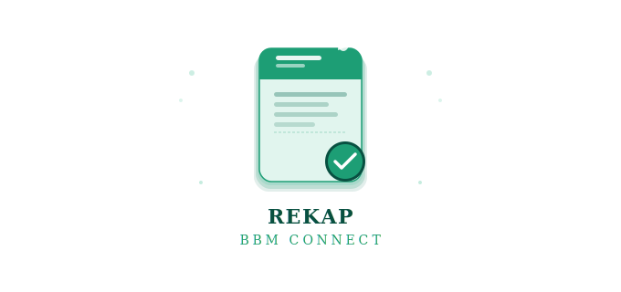

# Rekap BBM Connect

<div align="center">

<!-- Logo placeholder — replace with logo.svg from this project -->


**Aplikasi rekap & laporan BBM Connect berbasis web — ringan, cepat, tanpa instalasi.**

[](https://developer.mozilla.org/en-US/docs/Web/HTML)
[](https://script.google.com/)
[](https://sheets.google.com/)
[](https://vercel.com/)
[](LICENSE)

</div>

---

## Tentang Proyek

Rekap BBM Connect adalah aplikasi web yang dirancang untuk membantu proses verifikasi dan rekapitulasi data BBM Connect secara manual, sekaligus men-generate pesan laporan siap kirim ke admin — tanpa perlu mengisi ulang data dari nol.

Dibangun dengan arsitektur ringan (zero-dependency frontend) sehingga dapat dijalankan secara lokal maupun di-deploy ke Vercel dalam hitungan menit.

---

## Arsitektur

```
┌─────────────────────────────────────────────────────┐
│                    Frontend (Static)                 │
│           index.html · style.css · script.js         │
│         Vercel / Local · Zero dependencies           │
└────────────────────┬────────────────────────────────┘
                     │ HTTP GET / POST
                     ▼
┌─────────────────────────────────────────────────────┐
│              Backend (Google Apps Script)            │
│        Web App deployed as public endpoint           │
│         Menangani CRUD ke Google Spreadsheet         │
└────────────────────┬────────────────────────────────┘
                     │ Read / Write
                     ▼
┌─────────────────────────────────────────────────────┐
│               Database (Google Sheets)               │
│    Setiap sheet = satu bulan rekap (mis. Maret 2026) │
└─────────────────────────────────────────────────────┘
```

---

## Fitur Utama

- **Cek Struk (Menu Input)** — Bandingkan data aplikasi dengan foto struk. Input hanya kolom yang berbeda (Tanggal, KM, Harga); kolom yang sudah sesuai dikosongkan.
- **Cek Approval (Menu Unconditional)** — Catat status persetujuan: *Butuh approved 2*, *Butuh approved 3*, *Butuh di input*, atau *unverified*.
- **Pencegahan Duplikasi** — Cari ID sebelum input; jika ditemukan, data lama otomatis diisikan ke form (edit mode).
- **Generate Laporan Otomatis** — Satu klik menghasilkan pesan rekap berformat rapi, siap dikirim ke admin.
- **Multi-sheet / Multi-bulan** — Pilih sheet bulan yang aktif langsung dari aplikasi.

---

## Format Laporan

| Tipe Menu | Format Output |
|---|---|
| **Menu Input** | `ID >> [kolom yang diubah] menjadi [nilai]` |
| **Menu Unconditional** | `ID >> [Status Saat Ini]` |

> **Catatan:** Data dengan status `unverified` tetap disimpan ke sheet untuk dokumentasi, namun **tidak** muncul dalam pesan laporan.

**Contoh output:**
```
id1 >> tanggal 10 maret 2026, KM menjadi 34550
id2 >> Butuh approved 2
id3 >> harga menjadi 75000
```

---

## Cara Pemasangan

### Prasyarat

- Akun Google
- Akun GitHub (opsional, untuk deploy ke Vercel)
- Akun Vercel (opsional)

---

### 1. Persiapan Google Spreadsheet

1. Buka [Google Sheets](https://sheets.google.com/) dan buat spreadsheet baru.
2. Namai spreadsheet sesuai kebutuhan, misalnya **"Rekap BBM Connect"**.
3. Ubah nama **Sheet1** menjadi nama bulan, contoh: `Maret 2026`. Tambahkan sheet baru untuk bulan-bulan berikutnya sesuai kebutuhan.

---

### 2. Pasang Backend (Google Apps Script)

1. Di dalam spreadsheet, klik **Extensions → Apps Script**.
2. Hapus seluruh kode default di editor.
3. Salin isi file `backend/Code.gs` dari repositori ini, lalu tempel ke editor.
4. Simpan proyek (`Ctrl+S`).
5. Klik **Deploy → New deployment**.
6. Pilih ikon gerigi → **Web app**, lalu atur:

   | Pengaturan | Nilai |
   |---|---|
   | Execute as | `Me` |
   | Who has access | `Anyone` |

7. Klik **Deploy** → **Authorize access**.
8. Pilih akun Google Anda. Jika muncul peringatan *Google hasn't verified this app*, klik **Advanced → Go to ... (unsafe)** dan izinkan semua permission.
9. **Salin Web App URL** yang muncul (berakhiran `/exec`). URL ini dibutuhkan di langkah berikutnya.

---

### 3. Deploy Frontend ke Vercel

1. Upload folder `frontend/` ke repositori GitHub Anda.
2. Login ke [Vercel](https://vercel.com/) → **New Project** → Import repositori.
3. Atur **Root Directory** ke `frontend` jika diperlukan, lalu klik **Deploy**.
4. Setelah selesai, buka URL Vercel Anda.
5. Masukkan **Web App URL** dari Apps Script ke kolom *API URL* di aplikasi, lalu klik **Muat Bulan**.

> **Alternatif lokal:** Cukup buka `frontend/index.html` langsung di browser — tidak perlu server.

---

## Cara Penggunaan

```
1. Masukkan API URL → klik Muat Bulan
         ↓
2. Pilih sheet bulan yang sedang direkap
         ↓
3. Masukkan ID → klik Cari ID
         ↓
4. Pilih Tipe Pengecekan:
   • Menu Input       → isi kolom yang salah saja
   • Menu Unconditional → pilih status yang sesuai
         ↓
5. Klik Simpan Rekap
         ↓
6. Selesai rekap → klik Generate Pesan Rekap Bulan Ini
```

---

## Struktur Repositori

```
rekap-bbm-connect/
├── frontend/
│   ├── index.html
│   ├── style.css
│   └── script.js
├── backend/
│   └── Code.gs
├── assets/
│   └── logo.svg
└── README.md
```

---

## Tech Stack

| Layer | Teknologi |
|---|---|
| Frontend | HTML5, CSS3 (Vanilla), JavaScript (ES6+) |
| Backend | Google Apps Script |
| Database | Google Sheets |
| Hosting | Vercel (atau lokal) |

---

## Kontribusi

Pull request dan issue sangat disambut. Untuk perubahan besar, buka issue terlebih dahulu untuk mendiskusikan apa yang ingin diubah.

---

## Lisensi

[MIT](LICENSE) © 2026 Rekap BBM Connect
